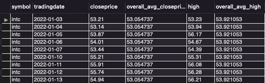

## Team Member
Seungmin Song

```{r setup, include=FALSE}
knitr::opts_chunk$set(eval=TRUE, message=FALSE, echo=FALSE, warning=FALSE)
```

```{r install-packages, echo=FALSE}

arrPackages <- c('RMySQL', 'DBI', 'dplyr', 'tidyverse')

installed_packages <- arrPackages %in% rownames(installed.packages())

if (any(installed_packages == FALSE)) {
  install.packages(arrPackages[!installed_packages], 
                   repos = "http://cran.us.r-project.org")
}

invisible(lapply(arrPackages, library, character.only = TRUE))

```


## Create a connection object to MySQL database.

```{r connect-mysql, echo=TRUE}
con = dbConnect(RMySQL::MySQL(),
                user='root',
                password='',
                host='localhost')
```


## Create database *stock* if not exists, and use database *stock*
```{r create-database, echo=TRUE}
res <- dbSendQuery(con, 'create database if not exists stock;')

res <- dbSendQuery(con, 'use stock;')

```


## Load data
The data were taken from the link below to the csv file, and the format of some columns was modified. \
[https://www.nasdaq.com/market-activity/stocks/amd/historical](https://www.nasdaq.com/market-activity/stocks/amd/historical) \
[https://www.nasdaq.com/market-activity/stocks/intc/historical](https://www.nasdaq.com/market-activity/stocks/intc/historical) \

```{r get-data, results='asis', echo=TRUE}
dfcsv <- read.csv('stockprice.csv')
tableName <- 'stock'
dbWriteTable(con,
             tableName, 
             dfcsv, 
             field.types=c(tradingdate='date', 
                           closeprice='double(8,2)', 
                           volume='bigint', 
                           open='double(8,2)', 
                           high='double(8,2)', 
                           low='double(8,2)', 
                           symbol='varchar(10)'),  
             row.names=FALSE, 
             overwrite=TRUE)
query <- "select * from stock"
stock <- fetch(dbSendQuery(con, query))

```


## Overall Average 
This was unintentionally found because "order by" was not entered after entering "partition by". **avg(x) over (partition by)** does **not** retrieve **Year-to-Date average** but takes the overall average. The result is as follows:\
\
select \
&nbsp;&nbsp;&nbsp;&nbsp; symbol, tradingdate, \
&nbsp;&nbsp;&nbsp;&nbsp; closeprice, avg(closeprice) over (partition by symbol) as overall_avg_closeprice, \
&nbsp;&nbsp;&nbsp;&nbsp; high, avg(high) over (partition by symbol) as overall_avg_high \
from \
&nbsp;&nbsp;&nbsp;&nbsp; stock \
where \
&nbsp;&nbsp;&nbsp;&nbsp; tradingdate < '2022-01-31' and symbol = 'amd' \
order by \
&nbsp;&nbsp;&nbsp;&nbsp; tradingdate asc \

{width=450}

\
Using **partition by** to divide the result set into partitions and calculate each subset of partitioned.Therefore, since the symbol is partitioned, it has the whole subset of the same symbol, so it returns the overall average, not Year-to_Date average, as the result value.\
\
The R syntax corresponding to the above query statement is as follows:
```{r overall-amd, echo=TRUE}
overall_avg_amd <- stock[order(stock$tradingdate), 
                     c('symbol', 'tradingdate', 'closeprice', 'high')] %>%
                filter(tradingdate < '2022-01-31' & symbol == 'amd') %>%
                mutate (
                  overall_avg_closeprice = mean(closeprice),
                  overall_avg_high = mean(high)
                )
print(overall_avg_amd[, c('symbol', 'tradingdate', 
                      'closeprice', 'overall_avg_closeprice', 
                      'high', 'overall_avg_high')])
```
\

\
select \
&nbsp;&nbsp;&nbsp;&nbsp; symbol, tradingdate, \
&nbsp;&nbsp;&nbsp;&nbsp; closeprice, avg(closeprice) over (partition by symbol) as overall_avg_closeprice, \
&nbsp;&nbsp;&nbsp;&nbsp; high, avg(high) over (partition by symbol) as overall_avg_high \
from \
&nbsp;&nbsp;&nbsp;&nbsp; stock \
where \
&nbsp;&nbsp;&nbsp;&nbsp; tradingdate < '2022-01-31' and symbol = 'intc' \
order by \
&nbsp;&nbsp;&nbsp;&nbsp; tradingdate asc \

{width=450}
\
The R syntax corresponding to the above query statement is as follows:
```{r overall-intel, echo=TRUE}
overall_avg_intel <- stock[order(stock$tradingdate), 
                     c('symbol', 'tradingdate', 'closeprice', 'high')] %>%
                filter(tradingdate < '2022-01-31' & symbol == 'intc') %>%
                mutate (
                  overall_avg_closeprice = mean(closeprice),
                  overall_avg_high = mean(high)
                )
print(overall_avg_intel[, c('symbol', 'tradingdate', 
                        'closeprice', 'overall_avg_closeprice', 
                        'high', 'overall_avg_high')])
```
\


## Year-to-Date Average
**avg(x) over (partition by ... order by asc)** retrieves **Year-to-Date average**. The result is as follows:\
\
select \
&nbsp;&nbsp;&nbsp;&nbsp; symbol, tradingdate, \
&nbsp;&nbsp;&nbsp;&nbsp; closeprice, avg(closeprice) over (partition by symbol order by tradingdate asc) as ytd_closeprice \
&nbsp;&nbsp;&nbsp;&nbsp; high, avg(high) over (partition by symbol order by tradingdate asc) as ytd_high \
from \
&nbsp;&nbsp;&nbsp;&nbsp; stock \
where \
&nbsp;&nbsp;&nbsp;&nbsp; tradinddate < '2022-01-31' and \
&nbsp;&nbsp;&nbsp;&nbsp; symbol = 'amd' \

{width=450}

\
The difference between this query and the previous query is whether or not it is sorted for a partitioned. By using "ORDER BY", the query obtains cumulative values from the beginning to the current row. Since this query used the avg() function, it takes the average from the beginning to the current row.\
\
The R syntax corresponding to the above query statement is as follows:\
The **cuumean()** function returns the accumulated mean value.
```{r year-to-date-amd, echo=TRUE}
ytd_amd <- stock[order(stock$tradingdate), 
             c('symbol', 'tradingdate', 'closeprice', 'high')] %>%
        filter(tradingdate < '2022-01-31' & symbol == 'amd') %>%
        mutate (
          ytd_closeprice = cummean(closeprice),
          ytd_high = cummean(high)
        )
print(ytd_amd[, c('symbol','tradingdate','closeprice','ytd_closeprice','high','ytd_high')])
```


\
select \
&nbsp;&nbsp;&nbsp;&nbsp; symbol, tradingdate, \
&nbsp;&nbsp;&nbsp;&nbsp; closeprice, avg(closeprice) over (partition by symbol order by tradingdate asc) as ytd_closeprice \
&nbsp;&nbsp;&nbsp;&nbsp; high, avg(high) over (partition by symbol order by tradingdate asc) as ytd_high \
from \
&nbsp;&nbsp;&nbsp;&nbsp; stock \
where \
&nbsp;&nbsp;&nbsp;&nbsp; tradinddate < '2022-01-31' and \
&nbsp;&nbsp;&nbsp;&nbsp; symbol = 'intc' \

{width=450}
\
The R syntax corresponding to the above query statement is as follows:\
The **cuumean()** function returns the accumulated mean value.
```{r year-to-date, echo=TRUE}
ytd_intel <- stock[order(stock$tradingdate), 
             c('symbol', 'tradingdate', 'closeprice', 'high')] %>%
        filter(tradingdate < '2022-01-31' & symbol == 'intc') %>%
        mutate (
          ytd_closeprice = cummean(closeprice),
          ytd_high = cummean(high)
        )
print(ytd_intel[, c('symbol','tradingdate','closeprice','ytd_closeprice','high','ytd_high')])
```

## Six-Day Moving Average

select \
&nbsp;&nbsp;&nbsp;&nbsp; symbol, tradingdate, closeprice, avg(closeprice) over (order by symbol, tradingdate \
&nbsp;&nbsp;&nbsp;&nbsp; rows between 5 preceding and current row) as ma_closeprice, high, \
&nbsp;&nbsp;&nbsp;&nbsp; avg(high) over (order by symbol, tradingdate rows between 5 preceding and current row) as ma_high \
from \
&nbsp;&nbsp;&nbsp;&nbsp; stock \
where \
&nbsp;&nbsp;&nbsp;&nbsp; symbol = 'amd' \

{width=450}

\
After sorting the rows, take the current row and the five preceding rows to average them.\
\
The R syntax corresponding to the above query statement is as follows:\
In order to find ma through googling, a package called zoo must be installed, but since the algorithm of simple moving average is very simple, so, decided to write and use the function ourselves.

```{r six-day-moving-amd, echo=TRUE}
moving_avg <- function(x, n) {
  res <- c()
  for(i in 1:length(x)){
    res <- c(res, ifelse(i < n, mean(x[1:i]), mean(x[(i-(n-1)):i])))
  }
  return(res)
}

ma_amd <- stock[order(stock$tradingdate), 
            c('symbol', 'tradingdate', 'closeprice', 'high')] %>%
      filter(tradingdate < '2022-01-31' & symbol == 'amd') %>%
      mutate (
        ma_closeprice = moving_avg(closeprice, 6),
        ma_high = moving_avg(high, 6)
      )
print(ma_amd[, c('symbol','tradingdate','closeprice','ma_closeprice','high','ma_high')])
```
\
select \
&nbsp;&nbsp;&nbsp;&nbsp; symbol, tradingdate, closeprice, avg(closeprice) over (order by symbol, tradingdate \
&nbsp;&nbsp;&nbsp;&nbsp; rows between 5 preceding and current row) as ma_closeprice, high, \
&nbsp;&nbsp;&nbsp;&nbsp; avg(high) over (order by symbol, tradingdate rows between 5 preceding and current row) as ma_high \
from \
&nbsp;&nbsp;&nbsp;&nbsp; stock \
where \
&nbsp;&nbsp;&nbsp;&nbsp; symbol = 'intc' \

{width=450}

```{r six-day-moving-intel, echo=TRUE}
ma_intel <- stock[order(stock$tradingdate), 
            c('symbol', 'tradingdate', 'closeprice', 'high')] %>%
      filter(tradingdate < '2022-01-31' & symbol == 'intc') %>%
      mutate (
        ma_closeprice = moving_avg(closeprice, 6),
        ma_high = moving_avg(high, 6)
      )
print(ma_intel[, c('symbol','tradingdate','closeprice','ma_closeprice','high','ma_high')])
```
The argument transmitted as a function in mutate is an object or a variable. For example, if the column name is closeprice, the entire closeprice column is transmitted as one object [ex. c('10', '20', '30', '40',…) or 1, 'a', etc.] In addition, the return value from the function must have the same number of elements as the elements originally transmitted. The moving_avg() function requires two arguments. The first argument accepts a column as a vector. The second factor is the number of rows to be treated as variables. The logic is very simple. First, generates an object **res <- c()** for return. Then, executes for…loop statement for number of element. In the case of the 'six-day moving average', if the variable *i* is less than or equal to 5, only an average from 1 to the current *i* value is obtained. And if the variable *i* exceeds 5, an average of the current *i* value and the previous five values are obtained.

x = vector (column with values of data frame) \
n = number variable (2-day, 3-day, 4-day, ..., n-day) \
i = index of x -> 1 to length(x) \ 
res = result variable to return \
res <- c(res, value) -> res = (1), res <- c(res, 2) then res = (1, 2) \

moving_avg <- function(x, n) { \
  res <- c() \
  for(i in 1:length(x)){ \
    res <- c(res, ifelse(i < n, mean(x[1:i]), mean(x[(i-(n-1)):i]))) \
  } \
  return(res) \
} \
\
[example] \
x = (1, 2, 3, 4, 5, 6, 7, 8, 9, 10) \
n = 6 \
i = 1 -> res = (1) \
i = 2 -> res = (1, 1.5) \
i = 3 -> res = (1, 1.5, 2) \
i = 4 -> res = (1, 1.5, 2, 2.5) \
i = 5 -> res = (1, 1.5, 2, 2.5, 3) \
i = 6 -> res = (1, 1.5, 2, 2.5, 3, 3.5) \
i = 7 -> res = (1, 1.5, 2, 2.5, 3, 3.5, 4.5) \
i = 8 -> res = (1, 1.5, 2, 2.5, 3, 3.5, 4.5, 5.5) \
i = 9 -> res = (1, 1.5, 2, 2.5, 3, 3.5, 4.5, 5.5, 6.5) \
i = 10 -> res = (1, 1.5, 2, 2.5, 3, 3.5, 4.5, 5.5, 6.5, 7.5) \
